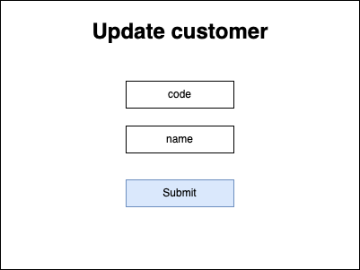

# Customer

## Description

A. Definition

Nothing to say about it. A customer is a customer :)

B. Schema

- Customer

```
id: string
code: string
name: string
addresses: Address[]
```

- Address

```
id: string
name: string
postalCode: string
city: string
country: string
default: boolean
```

- [Setting](../settings/README.md)

```
useCase: ProductSettingEnum
params: Parameter[]
```

---

# Screens

## Create Customer Form


## Update Customer Form



## View Customer


## View Customers


---

# Use case

- > [UC_CUSTOMER_CREATE_CUSTOMER](./create-customer.use-case.md#uccustomercreatecustomer)
- > [UC_CUSTOMER_UPDATE_CUSTOMER](./update-customer.use-case.md#uccustomerupdatecustomer)
- > [UC_CUSTOMER_REMOVE_CUSTOMER](./remove-customer.use-case.md#uccustomerremovecustomer)
