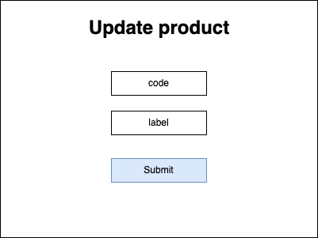

# Product

## Description

A. Definition

Nothing to say about it. A product is a product :)

B. Schema

- Product

```
id: string
code: string
label: string
```

- [Setting](../settings/README.md)

```
useCase: ProductSettingEnum
params: Parameter[]
```

---

# Screens

## Create Product Form


## Update Product Form



## View Product


## View Products


---

# Use case

- > [UC_PRODUCT_CREATE_PRODUCT](./create-product.use-case.md#ucproductcreateproduct)
- > [UC_PRODUCT_UPDATE_PRODUCT](./update-product.use-case.md#ucproductupdateproduct)
- > [UC_PRODUCT_REMOVE_PRODUCT](./remove-product.use-case.md#ucproductremoveproduct)
