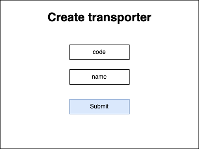
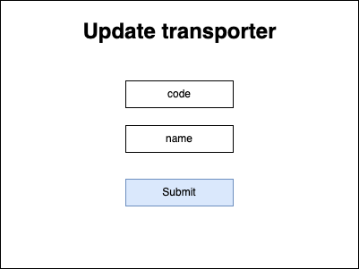
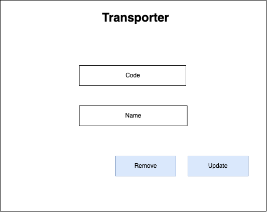
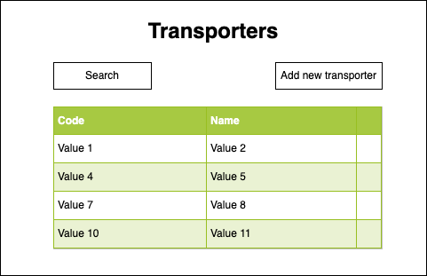

# Transporter

## Description

A. Definition

Nothing to say about it. A transporter is a transporter :)

B. Schema

- Transporter

```
id: string
code: string
name: string
```

- [Setting](../settings/README.md)

```
useCase: ProductSettingEnum
params: Parameter[]
```

---

# Screens

## Create Transporter Form



## Update Transporter Form



## View Transporter



## View Transporters



---

# Use case

- > [UC_TRANSPORTER_CREATE_TRANSPORTER](./create-transporter.use-case.md#uctransportercreatetransporter)
- > [UC_TRANSPORTER_UPDATE_TRANSPORTER](./update-transporter.use-case.md#uctransporterupdatetransporter)
- > [UC_TRANSPORTER_REMOVE_TRANSPORTER](./remove-transporter.use-case.md#uctransporterremovetransporter)
