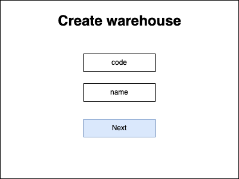
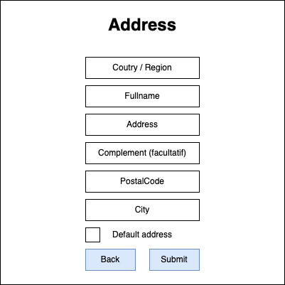
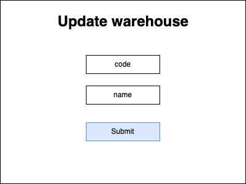
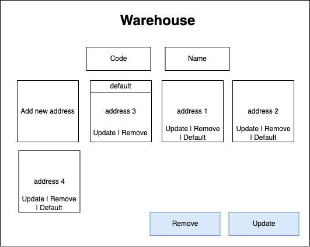
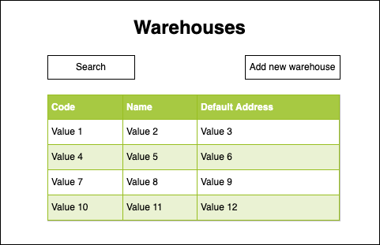

# Warehouse

## Description

A. Definition

Nothing to say about it. A warehouse is a warehouse :)

B. Schema

- Warehouse

```
id: string
code: string
name: string
addresses: Address[]
```

- Address

```
id: string
name: string
postalCode: string
city: string
country: string
default: boolean
```

- [Setting](../settings/README.md)

```
useCase: ProductSettingEnum
params: Parameter[]
```

---

# Screens

## Create Warehouse Form




## Update Warehouse Form



## View Warehouse



## View Warehouses



---

# Use case

- > [UC_WAREHOUSE_CREATE_WAREHOUSE](./create-warehouse.use-case.md#ucwarehousecreatewarehouse)
- > [UC_WAREHOUSE_UPDATE_WAREHOUSE](./update-warehouse.use-case.md#ucwarehouseupdatewarehouse)
- > [UC_WAREHOUSE_REMOVE_WAREHOUSE](./remove-warehouse.use-case.md#ucwarehouseremovewarehouse)
